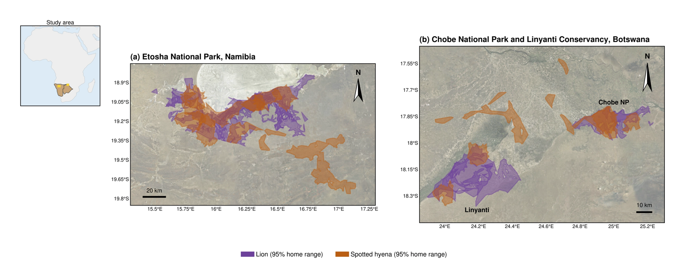
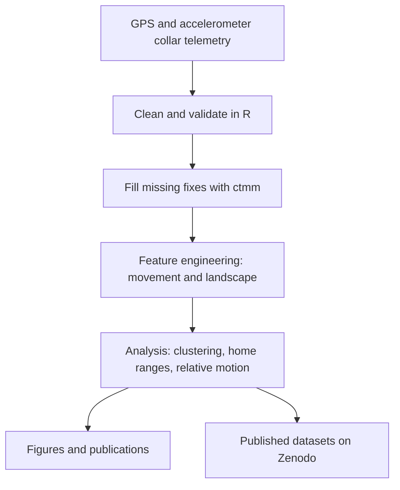

# Wildlife Behavior Classification

Data science and machine learning on GPS telemetry from African lions and spotted hyenas, built in collaboration with Dr. Nancy A. Barker (University of KwaZulu-Natal) for her PhD research on how these two competing carnivores share space in Etosha National Park (Namibia) and the Chobe, Linyanti and Okavango region (Botswana). I worked on the project from 2017 to 2021 and continued with the 2026 paper.

My role was the data side of the project: writing the code to process, clean and organize the telemetry, running the analyses, and producing most of the figures in the publications.

## Publications

1. Barker, N.A., Vissat, L.L., Joubert, F., **Stowbunenko, V.**, Alexander, K.A., Slotow, R., & Getz, W.M. (2026). Predators in Motion: Fine-scale dyadic movements reveal interference competition and asymmetric coordination in African lions and spotted hyenas. *Frontiers in Ethology*. https://doi.org/10.3389/fetho.2026.1901233
   My contribution: resources, software, visualization, and review and editing.

2. Barker, N.A., Joubert, F.G., Kasaona, M., Shatumbu, G., **Stowbunenko, V.**, Alexander, K.A., Slotow, R., & Getz, W.M. (2023). Coursing hyenas and stalking lions: The potential for inter- and intraspecific interactions. *PLOS ONE*, 18(2), e0265054. https://doi.org/10.1371/journal.pone.0265054
   My contribution: analysis code and the manuscript figures.

Both papers are open access.

## Published datasets

I am a named author on these Zenodo datasets. Both are restricted access: the records and DOIs are public, and the data files are available on request through Zenodo.

- Space use and simultaneous movement analyses of lions and spotted hyenas (2022): https://doi.org/10.5281/zenodo.6476304
- Movement and competition ecology of African lions in semi-arid and wetland ecosystems (2021): https://doi.org/10.5281/zenodo.5553554

*Figure 1 from Barker et al. (2026), Frontiers in Ethology, licensed under CC BY 4.0: study areas and 95% home ranges of lions and spotted hyenas over satellite imagery. I produced this map in Python (GeoPandas, Cartopy) from T-LoCoH home-range polygons.*

## The data pipeline

**Raw data.** GPS relocations from collared lions and spotted hyenas, with accelerometer activity values. The PLOS ONE study used 575,418 relocations from 19 lions and 14 hyenas; the Frontiers study used 349,163 relocations from 17 lions and 14 hyenas.

**Cleaning and gap filling.** Satellite upload failures left gaps in the fix schedule. Missing coordinates were filled with the `ctmm` R package, which fits continuous-time movement models (Calabrese, Fleming and Gurarie 2016). The Frontiers dyad analysis deliberately used real, concurrent fixes only.

**Feature engineering.** For each relocation: step length, speed, turning angle and tortuosity, plus landscape and timing variables such as distance to water sources and roads, vegetation (NDVI), land cover, time of day, season and moon illumination.

**Analysis.**
- **Factor analysis of mixed data (FAMD)** to select features from mixed continuous and categorical variables, then **k-prototypes clustering** (k-means for continuous plus k-modes for categorical features). The PLOS ONE paper was the first to apply this combination to large-carnivore space use.
- **T-LoCoH** (time-local convex hull) and kernel density estimation for home ranges and utilization distributions.
- **Relative-motion analysis** for the Frontiers paper: each animal's movement at each timestep classified as toward, orthogonal to, or away from its partner, using bearing calculations in R.
- Statistics including t-tests, chi-square, circular statistics (Watson's test) and mixed-effects models.

**Compute and tools.** R (data.table, dplyr, ggplot2, ctmm, adehabitatHR/LT, tlocoh, geosphere, clustMixType, CircStats, glmmTMB), Python for map figures (GeoPandas, Shapely, Cartopy), and heavy runs on Google Cloud with parallel processing across cores.

**Visualization.** Most of the figures in the publications, including maps of home-range polygons over satellite imagery. See the figures in the open-access papers linked above.

## Unpublished work

Behavior classification from GPS and accelerometer data using hidden Markov models and support vector machines combined with HMMs (SVM-HMM) is part of this project but **has not been published yet**, so no data, results or figures from it are shared here. The approach in brief: HMMs on step lengths and turning angles to identify movement states, and SVM-HMM to classify activity data that was mostly unlabeled, calibrated with a small set of field observations.

## Author

**Vincent Stowbunenko**: code development, data science and visualization. [HappyHackingOrange](https://github.com/HappyHackingOrange)

## Acknowledgments

This work was developed in collaboration with Dr. Nancy A. Barker, principal investigator of the field study, who designed the research and contributed the conceptual framework. The field study was conducted with Professor Wayne M. Getz (UC Berkeley) and Professor Rob Slotow (University of KwaZulu-Natal) as part of her PhD research.

## License

MIT License, see [LICENSE.md](LICENSE.md). The publications and datasets are licensed separately by their publishers.
