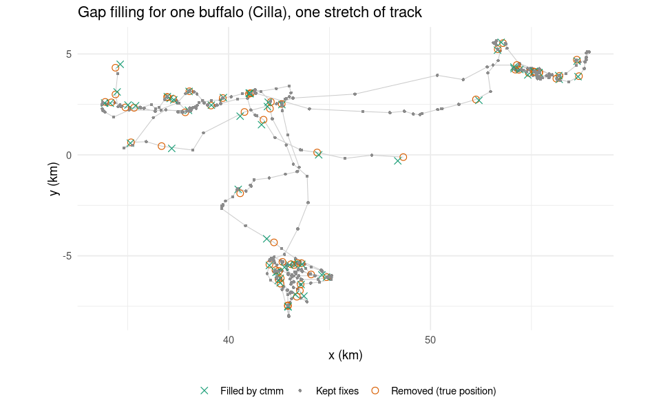
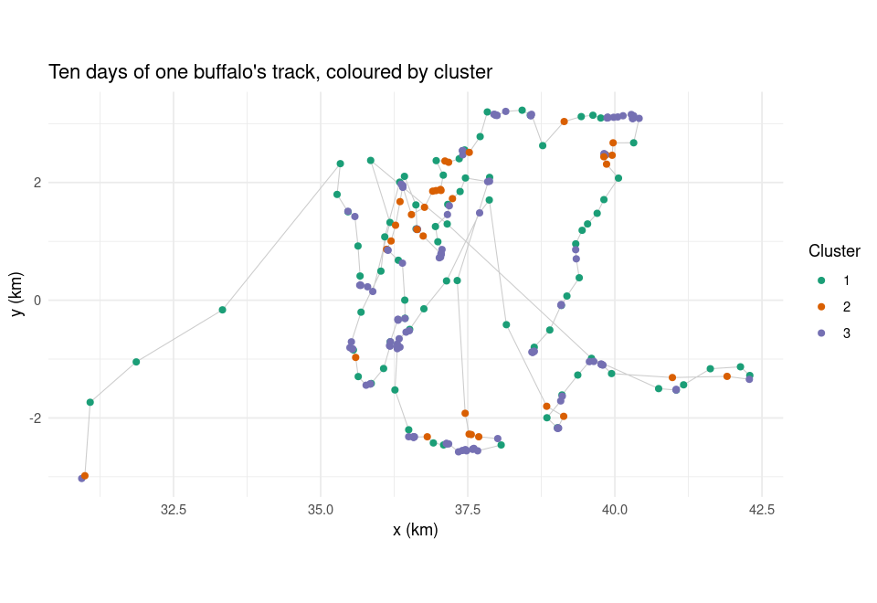
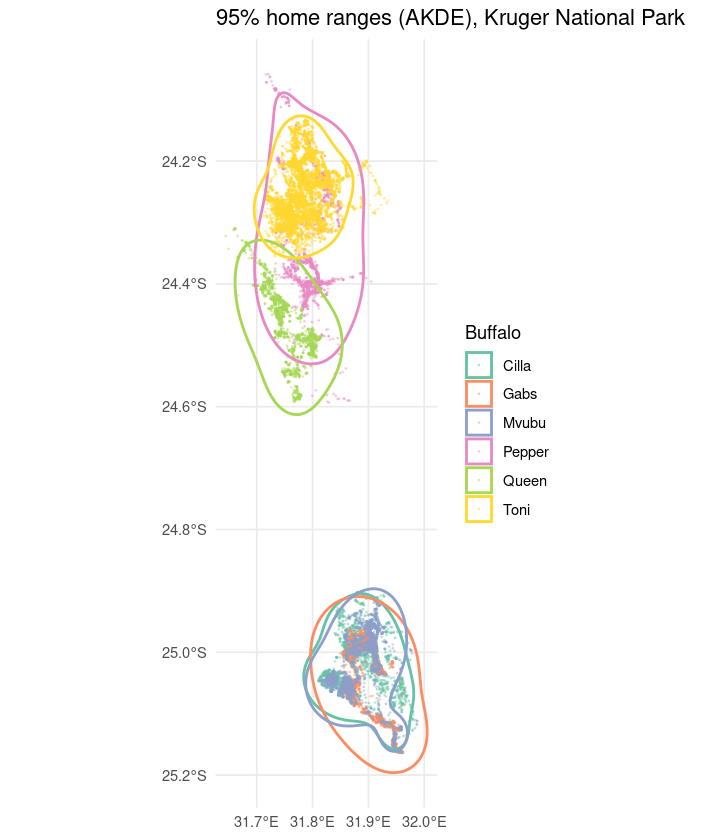

End-to-end movement pipeline on public data
================

This walks through the same stages as the lion and hyena work, from raw
GPS fixes to clusters, home ranges and figures, on a public dataset: the
African buffalo GPS data from Kruger National Park that ships with the
`ctmm` package. None of the lion or hyena data is used here.

``` r
library(ctmm)
library(data.table)
library(ggplot2)
library(FactoMineR)
library(clustMixType)
```

## 1\. Raw data

``` r
data(buffalo)
names(buffalo)
```

    ## [1] "Cilla"  "Gabs"   "Mvubu"  "Pepper" "Queen"  "Toni"

``` r
raw <- rbindlist(lapply(names(buffalo), function(id) {
  b <- buffalo[[id]]
  data.table(id = id, time = as.POSIXct(b$timestamp, tz = "Africa/Johannesburg"),
             x = b$x, y = b$y, lon = b$longitude, lat = b$latitude)
}))
raw[, .(fixes = .N, start = min(time), end = max(time)), by = id]
```

    ##        id fixes               start                 end
    ##    <char> <int>              <POSc>              <POSc>
    ## 1:  Cilla  3527 2005-07-14 05:35:00 2005-12-07 22:16:00
    ## 2:   Gabs  1996 2005-04-05 05:56:00 2005-06-27 03:45:00
    ## 3:  Mvubu  2572 2005-07-15 05:02:00 2005-10-29 18:49:00
    ## 4: Pepper  1725 2006-04-25 05:09:00 2006-12-31 14:34:00
    ## 5:  Queen  1756 2005-02-17 05:05:00 2005-06-02 03:43:00
    ## 6:   Toni  5766 2005-08-23 06:35:00 2006-04-22 23:09:00

## 2\. Cleaning and validation

Drop duplicate timestamps, then flag fixes that imply an implausible
speed. Buffalo rarely sustain more than a few km/h, so anything above 15
km/h between consecutive fixes is treated as a GPS error. The buffalo
data in `ctmm` has already been cleaned, so nothing is flagged here; on
raw collar data this step catches real location errors.

``` r
setorder(raw, id, time)
raw <- unique(raw, by = c("id", "time"))

raw[, dt_h := as.numeric(difftime(time, shift(time), units = "hours")), by = id]
raw[, step_m := sqrt((x - shift(x))^2 + (y - shift(y))^2), by = id]
raw[, speed_kmh := (step_m / 1000) / dt_h]

clean <- raw[is.na(speed_kmh) | speed_kmh <= 15]
cat(nrow(raw) - nrow(clean), "fixes removed as implausible\n")
```

    ## 0 fixes removed as implausible

## 3\. Filling gaps with a continuous-time movement model

Satellite collars miss fixes. Here one animal gets 10% of its fixes
removed at random, a continuous-time movement model is fitted with
`ctmm`, and the missing positions are predicted from it, so the
predictions can be checked against the true positions.

``` r
one <- buffalo[["Cilla"]]
drop <- sort(sample(seq_len(nrow(one)), round(0.10 * nrow(one))))
kept <- one[-drop, ]

guess <- ctmm.guess(kept, interactive = FALSE)
fit <- ctmm.select(kept, guess)
summary(fit)
```

    ## $name
    ## [1] "OUF anisotropic"
    ## 
    ## $DOF
    ##       mean       area  diffusion      speed 
    ##   11.00564   18.64514  839.31456 3088.48525 
    ## 
    ## $CI
    ##                                          low        est       high
    ## area (square kilometers)          241.269248 402.916951 605.339227
    ## τ[position] (days)                  4.349831   7.298394  12.245658
    ## τ[velocity] (minutes)              42.029838  44.776611  47.702894
    ## speed (kilometers/day)             13.564275  13.807782  14.051229
    ## diffusion (square kilometers/day)   5.405859   5.791066   6.189341

``` r
pred <- predict(fit, data = kept, t = one$t[drop])
err_m <- sqrt((pred$x - one$x[drop])^2 + (pred$y - one$y[drop])^2)
cat("Median error of filled positions:", round(median(err_m)), "m\n")
```

    ## Median error of filled positions: 108 m

``` r
# Zoom in on one stretch of track so individual filled positions are visible
win <- range(one$t[drop][200:260])
in_win <- function(t) t >= win[1] & t <= win[2]
gp <- rbind(
  data.table(t = kept$t, x = kept$x, y = kept$y, kind = "Kept fixes"),
  data.table(t = one$t[drop], x = one$x[drop], y = one$y[drop], kind = "Removed (true position)"),
  data.table(t = one$t[drop], x = pred$x, y = pred$y, kind = "Filled by ctmm"))[in_win(t)]
setorder(gp, t)
ggplot(gp, aes(x / 1000, y / 1000)) +
  geom_path(data = gp[kind != "Filled by ctmm"], colour = "grey80", linewidth = 0.3) +
  geom_point(aes(colour = kind, size = kind, shape = kind)) +
  scale_colour_manual(values = c("Kept fixes" = "grey55",
                                 "Removed (true position)" = "#d95f02",
                                 "Filled by ctmm" = "#1b9e77")) +
  scale_size_manual(values = c("Kept fixes" = 1, "Removed (true position)" = 2.4,
                               "Filled by ctmm" = 2.4)) +
  scale_shape_manual(values = c("Kept fixes" = 16, "Removed (true position)" = 1,
                                "Filled by ctmm" = 4)) +
  coord_equal() +
  labs(x = "x (km)", y = "y (km)", colour = NULL, size = NULL, shape = NULL,
       title = "Gap filling for one buffalo (Cilla), one stretch of track") +
  theme_minimal() + theme(legend.position = "bottom")
```

<!-- -->

## 4\. Feature engineering

For each fix: step length, speed, turning angle, a tortuosity measure
over a short window, and time of day as a category.

``` r
feat <- copy(clean)
feat[, heading := atan2(y - shift(y), x - shift(x)), by = id]
feat[, turn := (heading - shift(heading) + pi) %% (2 * pi) - pi, by = id]
feat[, tortuosity := {
  path <- frollsum(step_m, 6)
  net <- sqrt((x - shift(x, 6))^2 + (y - shift(y, 6))^2)
  net / path
}, by = id]
hr <- as.integer(format(feat$time, "%H"))
feat[, tod := factor(fifelse(hr >= 5 & hr < 8, "dawn",
               fifelse(hr >= 8 & hr < 17, "day",
               fifelse(hr >= 17 & hr < 20, "dusk", "night"))))]
feat <- feat[complete.cases(feat[, .(step_m, speed_kmh, turn, tortuosity)])]
feat[, .(id, time, step_m, speed_kmh, turn, tortuosity, tod)][1:5]
```

    ##        id                time     step_m  speed_kmh       turn tortuosity
    ##    <char>              <POSc>      <num>      <num>      <num>      <num>
    ## 1:  Cilla 2005-07-14 12:35:00   68.60861 0.06748388  0.1553277  0.6895429
    ## 2:  Cilla 2005-07-14 13:34:00   71.06247 0.07226692  3.0291910  0.3941268
    ## 3:  Cilla 2005-07-14 14:35:00 1251.14890 1.23063827  0.7793877  0.3520599
    ## 4:  Cilla 2005-07-14 15:35:00 1041.11477 1.04111477 -0.7794910  0.3337898
    ## 5:  Cilla 2005-07-14 16:34:00 1711.38780 1.74039437 -0.1764127  0.2651579
    ##       tod
    ##    <fctr>
    ## 1:    day
    ## 2:    day
    ## 3:    day
    ## 4:    day
    ## 5:    day

## 5\. Clustering mixed data: FAMD, then k-prototypes

FAMD summarises the continuous and categorical features together and
shows which ones carry the variation. k-prototypes then clusters the
fixes, using k-means distance for the numeric features and simple
matching for the categorical one.

``` r
X <- data.frame(step = log1p(feat$step_m), speed = log1p(feat$speed_kmh),
                abs_turn = abs(feat$turn), tortuosity = feat$tortuosity,
                tod = feat$tod)
famd <- FAMD(X, ncp = 4, graph = FALSE)
round(famd$eig[1:4, ], 1)
```

    ##        eigenvalue percentage of variance cumulative percentage of variance
    ## comp 1        2.0                   29.0                              29.0
    ## comp 2        1.3                   17.9                              46.9
    ## comp 3        1.0                   14.9                              61.8
    ## comp 4        0.9                   13.2                              75.0

``` r
round(famd$var$contrib[, 1:2], 1)
```

    ##            Dim.1 Dim.2
    ## step        39.8   1.4
    ## speed       39.8   0.9
    ## abs_turn     9.5  21.0
    ## tortuosity   0.2  46.1
    ## tod         10.6  30.7

``` r
Xs <- X
num <- c("step", "speed", "abs_turn", "tortuosity")
Xs[num] <- scale(Xs[num])
kp <- kproto(Xs, k = 3, nstart = 5, verbose = FALSE)
feat[, cluster := factor(kp$cluster)]
feat[, .(fixes = .N, median_speed_kmh = round(median(speed_kmh), 2),
         median_abs_turn = round(median(abs(turn)), 2),
         median_tortuosity = round(median(tortuosity), 2)), by = cluster][order(cluster)]
```

    ##    cluster fixes median_speed_kmh median_abs_turn median_tortuosity
    ##     <fctr> <int>            <num>           <num>             <num>
    ## 1:       1  5376             0.43            0.49              0.85
    ## 2:       2  4601             0.19            1.70              0.42
    ## 3:       3  7329             0.03            1.32              0.82

``` r
# One buffalo over ten days, so each cluster is visible along the track
sub <- feat[id == "Cilla"][time < min(time) + as.difftime(10, units = "days")]
ggplot(sub, aes(x / 1000, y / 1000)) +
  geom_path(colour = "grey80", linewidth = 0.3) +
  geom_point(aes(colour = cluster), size = 1.6) +
  coord_equal() +
  scale_colour_brewer(palette = "Dark2") +
  labs(x = "x (km)", y = "y (km)", colour = "Cluster",
       title = "Ten days of one buffalo's track, coloured by cluster") +
  theme_minimal()
```

<!-- -->

## 6\. Home ranges

Autocorrelated kernel density estimates from `ctmm`, with the 95%
contour for each animal. The original study used T-LoCoH and kernel
density for this step; AKDE is the `ctmm` equivalent and accounts for
the autocorrelation in GPS fixes.

``` r
fits <- lapply(buffalo, function(b) ctmm.select(b, ctmm.guess(b, interactive = FALSE)))
akdes <- akde(buffalo, fits)
areas <- sapply(akdes, function(a) summary(a, units = FALSE)$CI[2] / 1e6)
round(areas, 1)
```

    ##  Cilla   Gabs  Mvubu Pepper  Queen   Toni 
    ##  376.2  504.0  363.9  757.0  417.1  333.6

``` r
hr_sf <- do.call(rbind, lapply(names(akdes), function(id) {
  s <- as.sf(akdes[[id]], level.UD = 0.95)
  s <- s[grepl("est", s$name), ]
  s$id <- id
  s
}))
pts <- clean[, .(id, lon, lat)]
ggplot() +
  geom_point(data = pts, aes(lon, lat, colour = id), size = 0.2, alpha = 0.3) +
  geom_sf(data = sf::st_transform(hr_sf, 4326), aes(colour = id), fill = NA, linewidth = 0.8) +
  scale_colour_brewer(palette = "Set2") +
  scale_x_continuous(breaks = scales::breaks_pretty(n = 3)) +
  labs(x = NULL, y = NULL, colour = "Buffalo",
       title = "95% home ranges (AKDE), Kruger National Park") +
  theme_minimal()
```

<!-- -->

## What carries over to the real study

The lion and hyena work ran these stages at a much larger scale, with
landscape features such as distance to water and roads, vegetation and
moon illumination added to the movement features, and relative-motion
analysis between pairs of animals on top. That analysis is described in
the main README and the papers.

**Data credit:** buffalo data from the `ctmm` package (Fleming and
Calabrese), originally collected by Paul Cross and colleagues in Kruger
National Park.
